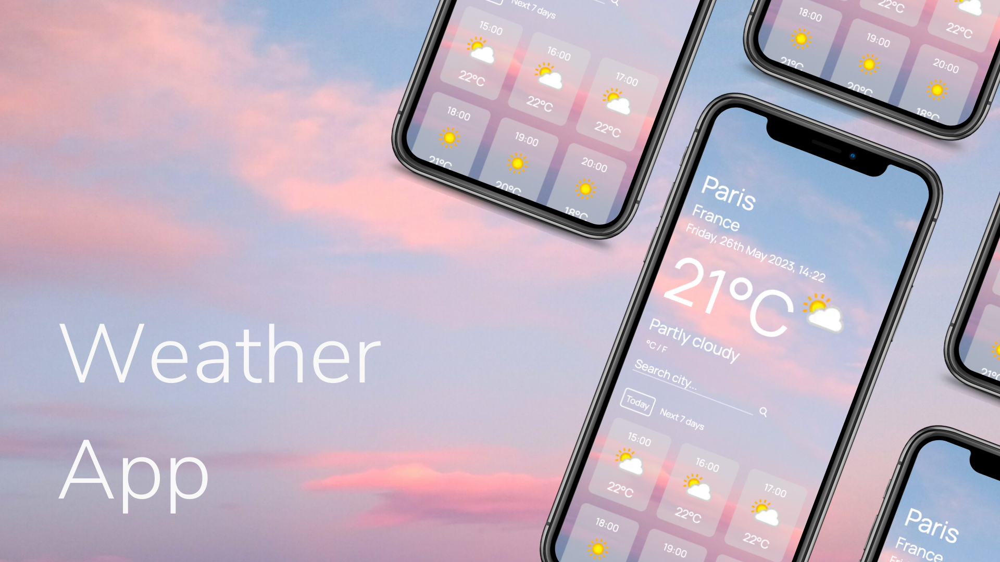
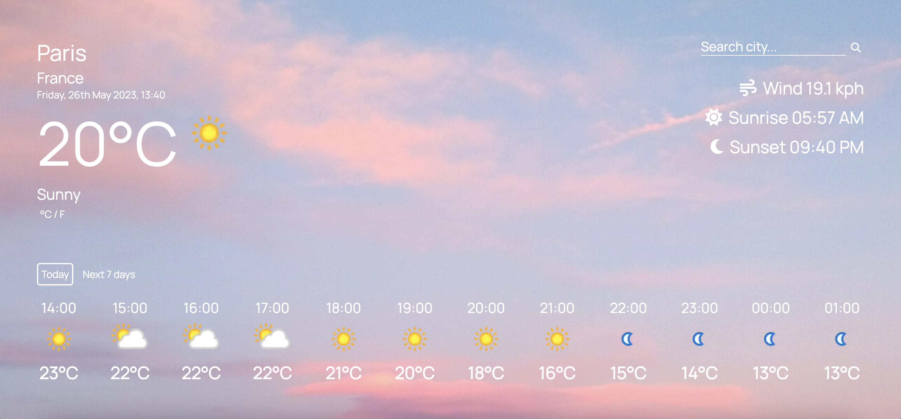

# Weather App

## [Live Demo](https://erinsophie.github.io/weather-app/)

# Technologies Used

- HTML
- CSS
- Javascript

# Project goals

- The main goal of this project was to learn how Javascript Promises work, particularly async and await.

# Features

- Makes fetch requests to get data from the Weather API
- Search for any city and the current data, including local time, temperature and condition will be displayed
- Toggle to see either today's forecast or this week's forecast
- Displays the next 12 hours of weather, adjusting for the city's local time.
